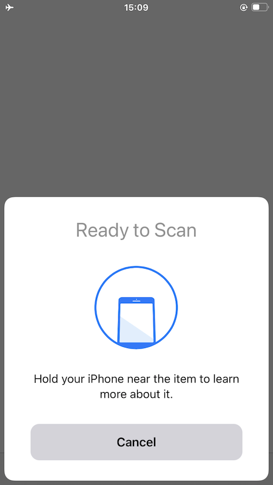

# ios-nfc-tagreader

Minimalist iOS application for reading NFC tags and displaying their values.

## Important

This is an early stage application and lacks thorough documentation or error handling.

Although there are definitely places where this application can be improved it is meant to be minimalist, by design. It's only purpose is to read atomic NFC tags and to serve a reference implementation for how that functionality works in iOS.

## Caveats

* This application expects "well known text" message payloads.

## Example

### Launch

### Scanning

### Display

## See also

* https://github.com/aaronland/ios-nfc-tagwriter